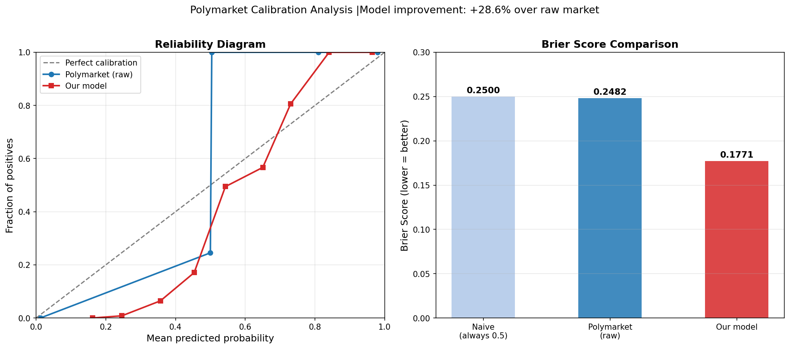
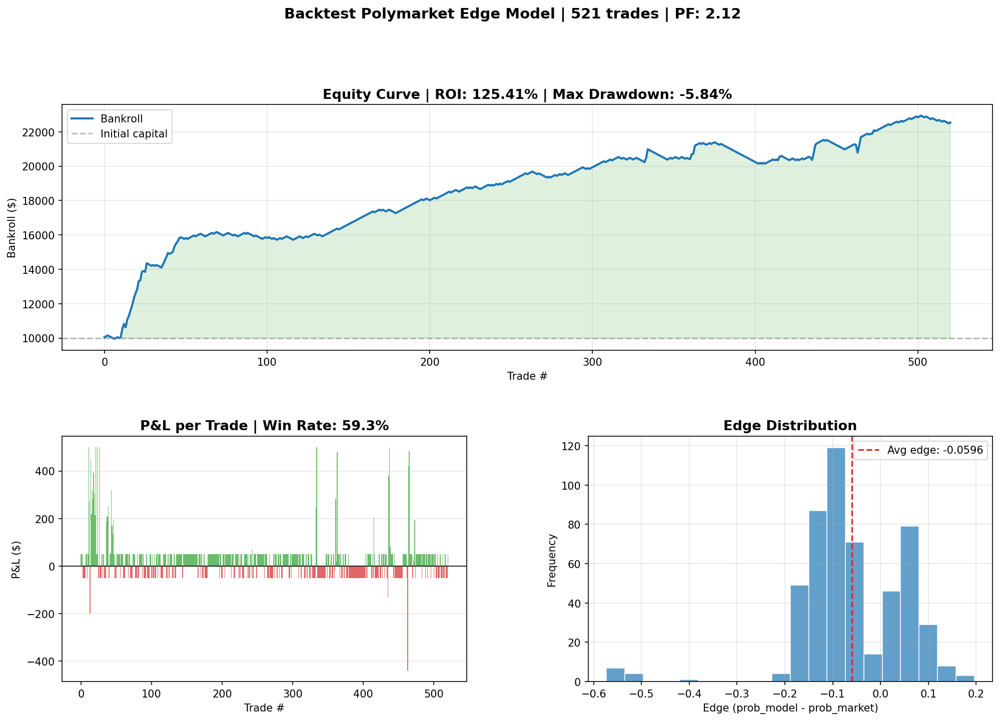

# POLYMARKET EDGE MODEL

Polymarket is a decentralized prediction market where people trade on the outcomes of real-world events. Each market has an implied probability, but that probability is not always right.

This project builds a systematic pipeline to find mispriced markets using two complementary approaches: comparing Polymarket prices against external forecasting platforms, and training a machine learning model on thousands of historical resolved markets.

---

## WHAT I WORKED ON

- **API integration**: Connected to Polymarket's public Gamma and CLOB APIs to fetch live markets, order book data, spreads, and price history (no authentication required).
- **External probability comparison**: Searched Metaculus and Manifold Markets for questions matching each Polymarket market, then calculated the edge between platforms using the Kelly Criterion for position sizing.
- **Calibration model**: Downloaded 3,000 resolved markets (with known YES/NO outcomes) and trained a Random Forest to detect whether Polymarket systematically mis-prices certain types of markets.
- **Brier Score analysis**: Evaluated the model using proper probabilistic scoring and generated a Reliability Diagram showing where Polymarket's calibration breaks down.
- **Backtesting**: Simulated historical P&L over 521 trades using a temporal train/test split, Half-Kelly position sizing, and realistic liquidity constraints.

## PROJECT STRUCTURE

- `polymarket_api.py`: Polymarket API client, it fetches active markets and order book data.
- `expected_value.py`: External comparison pipeline (Metaculus + Manifold + Kelly sizing).
- `calibration.py`: ML calibration model (training, evaluation, and signal generation). Exposes `train_random_forest()` as a canonical production model shared with the backtester.
- `backtester.py`: Historical P&L simulation with temporal split and risk management.
- `signal_engine.py`: Unified signal generator. Combines the calibration model and external consensus (Metaculus/Manifold) into a ranked list of trading opportunities. External sources upgrade signla confidence to HIGH but do not modify position sizing, which is based solely on the back tested RF model.
- `paper_trader.py`: Paper trading portfolio manager: tracls open positions, computes P&L on resolution, and persists state to disk across bot restarts.
- `bot.py`: Main loop, orchestrates the full pipeline on demand. Trains the model once, generates signals, checks open position resolutions via the Gamma API, and opens new positions.

## CALIBRATION RESULTS

The calibration model was trained on **3,000 resolved markets** from 2024–2025:

| Model               | Brier Score |
| ------------------- | ----------- |
| Naive (always 50%)  | 0.2500      |
| Polymarket raw      | 0.2482      |
| Logistic Regression | 0.2312      |
| **Random Forest**   | **0.2161**  |

The Random Forest achieves a **12.9% improvement** over the raw market probability, suggesting Polymarket has systematic calibration biases; particularly the longshot bias (overpricing unlikely events).



## BACKTEST RESULTS

The backtester uses a **temporal split** (not random) to avoid look-ahead bias: the model trains on the first 70% of markets by date (Jan-May 2024) and simulates trades on the remaining 30% (May 2024-Jan 2025).

| Metric            | Value                          |
| ----------------- | ------------------------------ |
| Test period       | May 2024 - Jan 2025 (8 months) |
| Total trades      | 521                            |
| Win rate          | 59.3%                          |
| ROI               | +125.4%                        |
| Max drawdown      | -5.84%                         |
| Profit factor     | 2.12                           |
| Avg position size | $67                            |
| Brier improvement | +4.0% over raw market          |

Position sizing uses **Half-Kelly** capped at 10% of bankroll and 10% of each market's reported liquidity. The model shows a strong BUY NO bias which is consistent with the longshot bias where Polymarket overprices unlikely YES outcomes.



### Backtest assumption and limitations

- **Spread**: Resolved markets report unreliable spread (no active trading). I assume a 5¢ spread cap, which is conservative for active markets.

- **Entry price (known limitation)**: Uses `(bestBid + bestAsk) / 2` from the Gamma API as the pre-resolution probability. The Gamma API only returns the _final_ bid/ask of a resolved market (it does not provide a price time-series). This means the recorded price may have been captured significantly before resolution (e.g. a market may have stopped trading in January but resolved in May, with the API returning the January price). Fixing this would require historical intraday price data, which is not available through the public API. This is a primary source of uncertainty in the backtest results.

- **Slippage**: Position sizes are capped at 10% of each market's liquidity to approximate slippage, but real orderbook impact is not modeled.

- **Fees**: Polymarket had zero fees until early 2026. Current fee structure only significantly impacts positions near 50¢. The test period (2024) was fee-free.

- **No live validation**: The model has not been validated with real trades or P&L tracking.

## LIMITATIONS

**Entry price data**: As described above, the Gamma API does not provide price time-series for resolved markets. The backtest uses the final recorded bid/ask as a proxy for the pre-resolution price, which may be stale for markets that stopped trading before resolution.

**External match quality**: External matches in `expected_value.py` rely on text search and can return semantically similar but non-identical questions. Always verify the `match_title` before acting on a signal.

**BUY NO bias**: The calibration model shows a BUY NO bias when applied to active markets, likely due to the 3:1 NO/YES class imbalance in the training data. `class_weight="balanced"` partially corrects this but does not eliminate it.

**Automation**: The bot (`bot.py`) is fullt implemented and runs the complete pipeline. Contintots 24/7 execution is currently not possible due to hardware constraints (no dedicated server), but the bot is fully functional when run manually. Live order execution is pending two things: validating profitability through paper trading, and the CLOB v2 release (April-May 2026).

## REQUIREMENTS

`pip install requests pandas numpy scikit-learn matplotlib`

## EXECUTION

```bash
python polymarket_api.py    # download active markets
python expected_value.py    # external probability signals
python calibration.py       # ML calibration signals
python backtester.py        # historical P&L simulation
python bot.py               # run one full cycle (signals + portfolio update)
python bot.py --loop        # run continuously every 30 minutes
python bot.py --status      # print current paper portfolio
python bot.py --resolve-only  # check open position resolutions only
```
