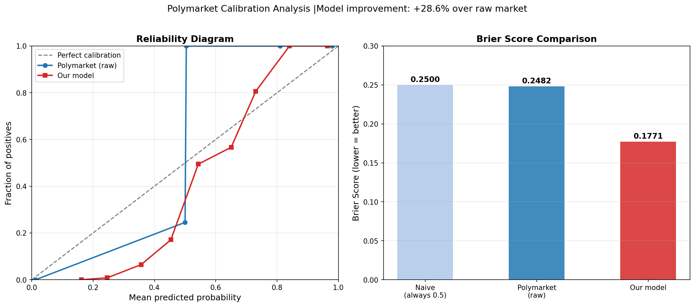
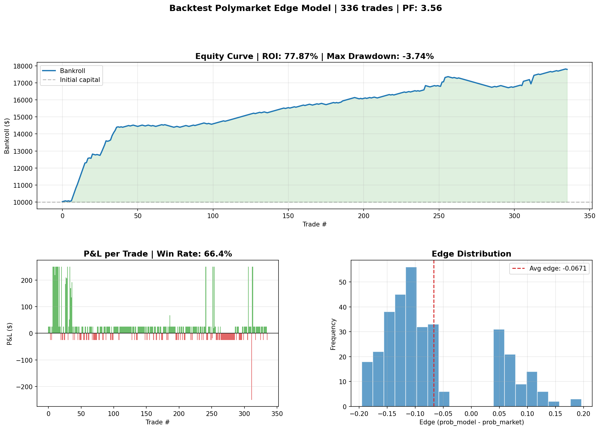

# POLYMARKET EDGE MODEL

Polymarket is a decentralized prediction market where people trade on the outcomes of real-world events. Each market has an implied probability, but that probability is not always right.

This project builds a systematic pipeline to find mispriced markets in two ways: comparing Polymarket prices against external forecasting platforms, and training a machine learning model on thousands of historical resolved markets.

_Last updated **2026-08-12**. Every results section below is a dated snapshot; the bot keeps trading and committing state to `data/` after that date, so if these dates look old, the numbers are too. Current state lives in `data/paper_portfolio.json` and `data/metrics_history.jsonl`._

---

## WHAT I WORKED ON

- **API integration**: Connected to Polymarket's public Gamma and CLOB APIs to fetch live markets, order book data, spreads, and price history (no authentication required).
- **External probability comparison**: Searched Metaculus and Manifold Markets for questions matching each Polymarket market, then calculated the edge between platforms using the Kelly Criterion for position sizing.
- **Calibration model**: Downloaded 3,000 resolved markets (with known YES/NO outcomes) and trained a Random Forest to detect whether Polymarket systematically mis-prices certain types of markets.
- **Brier Score analysis**: Evaluated the model using proper probabilistic scoring and generated a Reliability Diagram showing where Polymarket's calibration breaks down.
- **Backtesting**: Simulated historical P&L over 336 trades using a temporal train/test split, Half-Kelly position sizing, and realistic liquidity constraints.

## PROJECT STRUCTURE

- `polymarket_api.py`: Polymarket API client, it fetches active markets and order book data.
- `expected_value.py`: External comparison pipeline (Metaculus + Manifold + Kelly sizing).
- `calibration.py`: ML calibration model (training, evaluation, and signal generation). Exposes `train_random_forest()` as a canonical production model shared with the backtester.
- `backtester.py`: Historical P&L simulation with temporal split and risk management.
- `signal_engine.py`: Unified signal generator. Combines the calibration model and external consensus (Metaculus/Manifold) into a ranked list of trading opportunities. External sources upgrade signal confidence to HIGH but do not modify position sizing, which is based solely on the backtested RF model.
- `paper_trader.py`: Paper trading portfolio manager: tracks open positions, computes P&L on resolution, and persists state to disk across bot restarts.
- `bot.py`: Main loop, orchestrates the full pipeline on demand. Trains the model once, generates signals, checks open position resolutions via the Gamma API, and opens new positions.

## CALIBRATION RESULTS

The calibration model was trained on **3,000 resolved markets** from 2024-2025:

| Model               | Brier Score |
| ------------------- | ----------- |
| Naive (always 50%)  | 0.2500      |
| Polymarket raw      | 0.2482      |
| Logistic Regression | 0.2312      |
| **Random Forest**   | **0.2161**  |

The Random Forest achieves a **12.9% improvement** over the raw market probability, suggesting Polymarket has systematic calibration biases; particularly the longshot bias (overpricing unlikely events).



## BACKTEST RESULTS

The backtester uses a **temporal split** (not random) to avoid look-ahead bias: the model trains on the first 70% of markets by date (Jan-Apr 2024) and simulates trades on the remaining 30% (Apr-Dec 2024).

| Metric            | Value                          |
| ----------------- | ------------------------------ |
| Test period       | Apr 2024 - Dec 2024 (8 months) |
| Total trades      | 291                            |
| Win rate          | 66.0%                          |
| ROI               | +94.7%                         |
| Max drawdown      | -3.64%                         |
| Profit factor     | 4.52                           |
| Avg position size | $51                            |
| Brier improvement | +4.4% over raw market          |

_Last re-run: 2026-07-12, with the minimum edge lowered to 3% (validated against 4% and 5%: on the same model and test set, 3% produced more trades (291 vs 233) with a higher win rate, higher ROI and a smaller drawdown), the live signal guards applied (see below) and the live $250 per-position hard cap. Note: the Gamma API now rejects offsets beyond ~2,100 resolved markets (HTTP 422), so the dataset is smaller than the 3,000 used in earlier runs; the live bot trains through the same call, so backtest and live model remain identical._

Position sizing uses **Half-Kelly** capped at 10% of bankroll, 10% of each market's reported liquidity, and a $250 hard cap per position (the same limits the live bot uses). The model shows a strong BUY NO bias which is consistent with the longshot bias where Polymarket overprices unlikely YES outcomes.



### Backtest assumption and limitations

- **Signal guards**: The simulation applies the same anti-artifact filters as the live signal engine: no BUY YES on markets priced below 0.15, no BUY NO above 0.85, and no signals with |edge| > 0.30 (treated as model error rather than mispricing). This keeps the backtest simulating exactly what the bot would trade.

- **Spread**: Resolved markets report unreliable spread (no active trading). I assume a 5¢ spread cap, which is conservative for active markets.

- **Entry price (known limitation)**: Uses `(bestBid + bestAsk) / 2` from the Gamma API as the pre-resolution probability. The Gamma API only returns the _final_ bid/ask of a resolved market (it does not provide a price time-series). This means the recorded price may have been captured significantly before resolution (e.g. a market may have stopped trading in January but resolved in May, with the API returning the January price). Fixing this would require historical intraday price data, which is not available through the public API. This is a primary source of uncertainty in the backtest results.

- **Slippage**: Position sizes are capped at 10% of each market's liquidity to approximate slippage, but real orderbook impact is not modeled.

- **Fees**: Polymarket had zero fees until early 2026. Current fee structure only significantly impacts positions near 50¢. The test period (2024) was fee-free.

- **Live validation**: two months of live paper trading are recorded below. So far they do not validate the backtest.

## LIVE PAPER TRADING RESULTS

The bot has been paper trading live via GitHub Actions since 2026-06-12, starting from a $10,000 bankroll. The numbers below are a snapshot, last updated **2026-08-12**. They go stale the moment the bot runs again; if that date is old, trust `data/paper_portfolio.json` and `data/metrics_history.jsonl` over this section.

### Snapshot as of 2026-08-12 (two months live)

| Metric          | Value                               |
| --------------- | ----------------------------------- |
| Resolved trades | 44                                  |
| Total P&L       | +$1,292 (equity at cost: $11,292)   |
| Win rate        | 27.3%                               |
| By month        | Jun +$698, Jul +$3,113, Aug -$2,518 |
| Open positions  | 39 ($7,905 at cost)                 |

That +$1,292 does not hold up once you look at where it comes from:

- **Edge realization**: 43 of the 44 resolved trades were BUY YES at an average price of 0.280, and 25.6% of them won, which is the market-implied rate. The model claimed an average edge of +0.267 on these trades, implying a win rate near 55%. A win rate that matches the price paid is what "the market was right and the edge is an artifact" looks like.
- **Concentration**: the P&L is carried by three trades: two near-duplicate Iran markets resolved YES on 07-17/18 (one bet counted twice, +$1,979 combined) plus one BUY NO (+$1,179). BUY YES without the Iran pair is -$1,865.
- **August**: -$2,518 over 20 trades (mean -$126 per trade, t = -2.89).
- **Sports**: 7 spread and over/under trades, 0 wins, -$1,384. Like the sub-hourly crypto markets already excluded, the model has no signal on game outcomes.
- **Guards**: the distribution-shift artifact moved past them. The 0.15 price floor stopped the sub-0.15 BUY YES flood, but the same inflated P(YES) now fires on markets priced 0.18 to 0.39: 38 of 39 open positions are BUY YES with claimed edges packed into the 0.20 to 0.30 band, just under the |edge| > 0.30 rejection cap. 27 of the 39 positions sit at the $250 cap, and $4,212 (53% of open cost) is a single correlated Iran/Mid-East cluster.
- **Expiry refund**: one of the 44 "resolved" trades is not a resolution. The bot returned the $250 stake of "Israel closes its airspace by August 31?" after its listed end date passed, but the market is still trading (0.055 YES at snapshot time): the expiry logic trusts `end_date` plus 7 days of grace without checking whether the market actually closed. Counted as the near-certain loss it is, live P&L drops to about +$1,042.

Two months of paper trading have not validated the backtest; they have reproduced the known failure mode one price band higher. Before any live execution: exclude sports spread and over/under markets, treat BUY YES edges in the 0.20 to 0.30 band as suspect rather than tradeable, and make expiry check the market's closed flag instead of its listed end date.

## LIMITATIONS

**Entry price data**: As described above, the Gamma API does not provide price time-series for resolved markets. The backtest uses the final recorded bid/ask as a proxy for the pre-resolution price, which may be stale for markets that stopped trading before resolution.

**External match quality**: External matches in `expected_value.py` rely on text search and can return semantically similar but non-identical questions. Always verify the `match_title` before acting on a signal.

**Distribution shift on active markets**: The model is trained on resolved markets, whose recorded price is the near-final bid/ask. Applied to active markets mid-life, `class_weight="balanced"` inflates P(YES) toward 0.5 on longshots, producing large fake edges that always point to BUY YES (live paper trading showed 26/27 open positions were BUY YES on markets priced 0.03 to 0.13). The signal engine now guards against this: it skips BUY YES signals on markets priced below 0.15 (and BUY NO above 0.85), and rejects any signal with |edge| > 0.30 as a likely model error rather than a real mispricing. The 2026-08-12 live snapshot shows these guards are not enough: the same artifact reappears one band higher, on markets priced 0.18 to 0.39.

**Automation**: The bot (`bot.py`) runs automatically via GitHub Actions every ~30 minutes, 24/7, at no cost. Live-only portfolio controls (not part of the backtest, which has no entry-time dimension): max 70% of equity deployed, max 5 new positions per cycle, and only markets resolving within 180 days. The market universe is fetched ordered by 24h volume (descending): Gamma's default ordering returns the oldest active markets first, which filled the scan with stale long-dated markets and starved the bot of signals. Sub-hourly crypto "Up or Down" markets are excluded (they sit near 50c, where current fees bite hardest, and resolve on price noise the model has no signal on). Live order execution is pending two things: paper trading validating profitability (which the 2026-08-12 snapshot does not support), and the CLOB v2 release.

## REQUIREMENTS

`pip install requests pandas numpy scikit-learn matplotlib`

## EXECUTION

```bash
python polymarket_api.py    # download active markets
python expected_value.py    # external probability signals
python calibration.py       # ML calibration signals
python backtester.py        # historical P&L simulation
python bot.py               # run one full cycle (signals + portfolio update)
python bot.py --loop        # run continuously every 30 minutes
python bot.py --status      # print current paper portfolio
python bot.py --resolve-only  # check open position resolutions only
```
